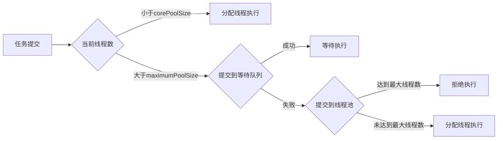

### 1.ThreadPoolExecutor构造函数：

```java
public ThreadPoolExecutor(int corePoolSize,
                          int maximumPoolSize,
                          long keepAliveTime,
                          TimeUnit unit,
                          BlockingQueue＜Runnable＞ workQueue,
                          ThreadFactory threadFactory,
                          RejectedExecutionHandler handler)

```

函数的参数含义如下。

- corePoolSize：指定了线程池中的线程数量。
- maximumPoolSize：指定了线程池中的最大线程数量。
- keepAliveTime：当线程池线程数量超过corePoolSize时，多余的空闲线程的存活时间。即，超过corePoolSize的空闲线程，在多长时间内，会被销毁。
- unit：keepAliveTime的单位。
- workQueue：任务队列，被提交但尚未被执行的任务。
- threadFactory：线程工厂，用于创建线程，一般用默认的即可。
- handler：拒绝策略。当任务太多来不及处理，如何拒绝任务。

参数workQueue指被提交但未执行的任务队列，它是一个BlockingQueue接口的对象，仅用于存放Runnable对象。根据队列功能分类，在ThreadPoolExecutor的构造函数中可使用以下几种BlockingQueue。

**直接提交的队列**：该功能由SynchronousQueue对象提供。SynchronousQueue是一个特殊的BlockingQueue。SynchronousQueue没有容量，每一个插入操作都要等待一个相应的删除操作，反之，每一个删除操作都要等待对应的插入操作。如果使用SynchronousQueue，提交的任务不会被真实的保存，而总是将新任务提交给线程执行，如果没有空闲的进程，则尝试创建新的进程，如果进程数量已经达到最大值，则执行拒绝策略。因此，使用SynchronousQueue队列，通常要设置很大的maximumPoolSize值，否则很容易执行拒绝策略。

**有界的任务队列**：有界的任务队列可以使用ArrayBlockingQueue实现。ArrayBlockingQueue的构造函数必须带一个容量参数，表示该队列的最大容量，如下所示。
`public ArrayBlockingQueue(int capacity)`
当使用有界的任务队列时，若有新的任务需要执行，如果线程池的实际线程数小于corePoolSize，则会优先创建新的线程，若大于corePoolSize，则会将新任务加入等待队列。若等待队列已满，无法加入，则在总线程数不大于maximumPoolSize的前提下，创建新的进程执行任务。若大于maximumPoolSize，则执行拒绝策略。可见，有界队列仅当在任务队列装满时，才可能将线程数提升到corePoolSize以上，换言之，除非系统非常繁忙，否则确保核心线程数维持在在corePoolSize。

**无界的任务队列**：无界任务队列可以通过LinkedBlockingQueue类实现。与有界队列相比，除非系统资源耗尽，否则无界的任务队列不存在任务入队失败的情况。当有新的任务到来，系统的线程数小于corePoolSize时，线程池会生成新的线程执行任务，但当系统的线程数达到corePoolSize后，就不会继续增加。若后续仍有新的任务加入，而又没有空闲的线程资源，则任务直接进入队列等待。若任务创建和处理的速度差异很大，无界队列会保持快速增长，直到耗尽系统内存。
**优先任务队列**：优先任务队列是带有执行优先级的队列。它通过PriorityBlockingQueue实现，可以控制任务的执行先后顺序。它是一个特殊的无界队列。无论是有界队列ArrayBlockingQueue，还是未指定大小的无界队列LinkedBlockingQueue都是按照先进先出算法处理任务的。而PriorityBlockingQueue则可以根据任务自身的优先级顺序先后执行，在确保系统性能的同时，也能有很好的质量保证（确保高优先级的任务先被执行）。

>使用自定义线程池时，要根据具体情况选择合适的并发队列。当资源不足时，不同的并发队列对系统的影响不同。


线程池的调度逻辑可以总结为：



### 2.拒绝策略

当线程数达到最大线程数maximumPoolSize，而且等待队列也已经排满，就需要一套机制来处理新任务。

JDK内置拒绝策略如下：

* AbortPolicy策略：该策略会直接抛出异常，阻止系统正常工作。
* CallerRunsPolicy策略：只要线程池未关闭，该策略直接在调用者线程中，运行当前被丢弃的任务。显然这样做不会真的丢弃任务，但是，任务提交线程的性能极有可能会急剧下降。
* DiscardOledestPolicy策略：该策略将丢弃最老的一个请求，也就是即将被执行的一个任务，并尝试再次提交当前任务。
* DiscardPolicy策略：该策略默默地丢弃无法处理的任务，不予任何处理。如果允许任务丢失，我觉得这可能是最好的一种方案了吧！

以上策略均实现了RejectedExecutionHandler接口，若无法满足需求，则可自己扩展这个接口：

```
new RejectedExecutionHandler(){
	@Override
	public void rejectedExecution(Runnable r, ThreadPoolExecutor executor) {
		System.out.println(r.toString()+" is discard");
	}
}

```


### 3.ThreadFactory

线程池的主要作用是为了线程复用，也就是避免了线程的频繁创建。而线程是谁创建的呢？线程是ThreadFactory创建的。

ThreadFactory是一个接口，它只有一个方法，用来创建线程：

` Thread newThread(Runnable r); `

可以自定义ThreadFactory帮助我们做一些事情，比如记录线程的创建，并设置为守护进程，这样主线程退出后，将强制销毁线程池。

```
new ThreadFactory() {
	@Override
	public Thread newThread(Runnable r) {
		Thread t = new Thread();
		t.setDaemon(true);
		System.out.println("create "+t);
		return t;
	}
}
```


> [原始链接]({{page.url}}) 版权声明：自由转载-非商用-非衍生-保持署名 \| [Creative Commons BY-NC-ND 4.0](http://creativecommons.org/licenses/by-nc-nd/4.0/deed.zh)

